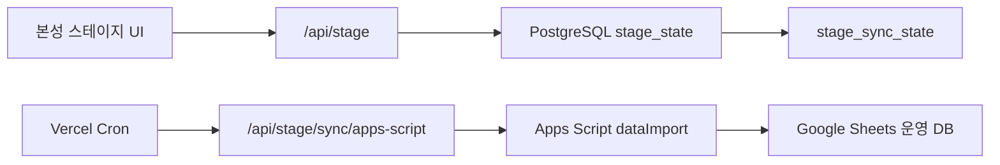

# 본성 스테이지 Vercel/PostgreSQL -> Apps Script Sync

This path stores user writes in the 본성 스테이지 API first, then mirrors the current state to Apps Script/Google Sheets. The browser does not call Apps Script directly during normal operation.



## Required environment

```env
NEXT_PUBLIC_BONSUNG_API_BASE_URL=/api/stage
NEXT_PUBLIC_ENABLE_BUFFERED_APPS_SCRIPT_SYNC=true

BONSUNG_STORAGE_DRIVER=postgres
BONSUNG_DATABASE_URL=<postgres-connection-url>
BONSUNG_LOCAL_SERVER_PASSWORD=<long-random-seed-password>
BONSUNG_ADMIN_INITIAL_PASSWORD=<admin-initial-password>
BONSUNG_SESSION_SECRET=<long-random-session-secret>
BONSUNG_ALLOWED_ORIGINS=<official-vercel-origin>

BONSUNG_APPS_SCRIPT_SYNC_ENABLED=true
BONSUNG_APPS_SCRIPT_ENDPOINT=<google-apps-script-web-app-url>
BONSUNG_APPS_SCRIPT_SYNC_LOGIN_ID=admin
BONSUNG_APPS_SCRIPT_SYNC_PASSWORD=<apps-script-admin-password>
CRON_SECRET=<long-random-cron-secret>
BONSUNG_APPS_SCRIPT_SYNC_ACCOUNTS=false
```

## Notes

- `BONSUNG_APPS_SCRIPT_SYNC_ACCOUNTS=false` is the default so Apps Script account rows are not overwritten accidentally.
- Vercel Hobby plans only allow once-per-day cron jobs. The project cron is set to `0 18 * * *`, which runs once daily around 03:00 KST. Use manual sync when immediate mirroring is needed.
- If `CRON_SECRET` is set, sync requests must include `Authorization: Bearer <CRON_SECRET>`.

## Manual sync

```powershell
curl -X POST https://<vercel-domain>/api/stage/sync/apps-script `
  -H "Authorization: Bearer <CRON_SECRET>" `
  -H "Content-Type: application/json" `
  -d "{\"force\":true}"
```

## Status

Managers/Admins can inspect `/sync/status` through the 본성 스테이지 API. A healthy state has no pending revision and no recent sync error.
