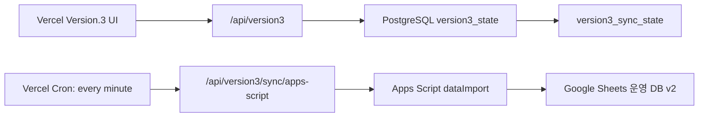

# Version.3 Vercel Buffer -> Apps Script Sync

## 목적

입력/수정 요청은 먼저 Vercel의 Version.3 API에 저장하고, Vercel Cron이 1분 간격으로 Apps Script `dataImport`를 호출해 Google Sheets 운영 DB로 밀어 넣습니다. 브라우저가 매 저장마다 Apps Script를 직접 호출하지 않으므로 체감 속도와 안정성이 좋아지고, Apps Script 장애가 있어도 Vercel 저장소에 변경분이 남습니다.



## 운영 조건

- `NEXT_PUBLIC_ENABLE_BUFFERED_APPS_SCRIPT_SYNC=true`이면 로그인은 Vercel API를 먼저 시도합니다.
- Vercel API 저장소는 `VERSION3_STORAGE_DRIVER=postgres`와 `VERSION3_DATABASE_URL`이 필요합니다.
- 파일 저장소는 Vercel 함수에서 영구 저장소가 아니므로 운영 버퍼로 쓰지 않습니다.
- Apps Script 계정 목록은 기본적으로 동기화하지 않습니다. `admin` 단일 계정 정책을 보호하기 위해 `VERSION3_APPS_SCRIPT_SYNC_ACCOUNTS=false`가 기본입니다.
- Vercel Cron은 `vercel.json`의 `/api/version3/sync/apps-script`를 `* * * * *`로 호출합니다.
- Vercel Hobby 계정은 하루 1회보다 잦은 Cron 배포를 거절합니다. 1분 주기를 그대로 운영하려면 Vercel Pro 이상이 필요하고, Pro 전환 전에는 외부 스케줄러가 같은 엔드포인트를 호출해야 합니다.
- 동기화 엔드포인트는 `CRON_SECRET`이 설정된 경우 `Authorization: Bearer <CRON_SECRET>` 요청만 허용합니다. 운영 환경에서는 `CRON_SECRET`이 없으면 실행하지 않습니다.

## 필요한 Vercel 환경 변수

```env
NEXT_PUBLIC_VERSION3_API_BASE_URL=/api/version3
NEXT_PUBLIC_ENABLE_BUFFERED_APPS_SCRIPT_SYNC=true
NEXT_PUBLIC_ENABLE_APPS_SCRIPT_TRANSITION=true
NEXT_PUBLIC_APPS_SCRIPT_ENDPOINT=https://script.google.com/macros/s/AKfycbwk0TzTPzv3ysOd40dqtp3UMdsRu444kNW8ZiRA2vj7kOvAhSb-lORp5_HZCXi_T1Q/exec

VERSION3_STORAGE_DRIVER=postgres
VERSION3_DATABASE_URL=<postgres-connection-url>
VERSION3_LOCAL_SERVER_PASSWORD=<long-random-seed-password>
VERSION3_OWNER_INITIAL_PASSWORD=<owner-initial-password>
VERSION3_SESSION_SECRET=<long-random-session-secret>
VERSION3_ALLOWED_ORIGINS=<official-vercel-origin>

VERSION3_APPS_SCRIPT_SYNC_ENABLED=true
VERSION3_APPS_SCRIPT_ENDPOINT=https://script.google.com/macros/s/AKfycbwk0TzTPzv3ysOd40dqtp3UMdsRu444kNW8ZiRA2vj7kOvAhSb-lORp5_HZCXi_T1Q/exec
VERSION3_APPS_SCRIPT_SYNC_LOGIN_ID=admin
VERSION3_APPS_SCRIPT_SYNC_PASSWORD=<apps-script-admin-password>
CRON_SECRET=<long-random-cron-secret>
VERSION3_APPS_SCRIPT_SYNC_ACCOUNTS=false
```

## 상태 확인

- 로그인 후 AppShell 연결 상태는 버퍼 모드에서 `/sync/status`를 확인합니다.
- `connected`: 대기 중인 변경분이 없고 마지막 동기화 오류가 없습니다.
- `unstable`: 변경분이 대기 중이거나 최근 Apps Script 전송 오류가 있습니다.
- `disconnected`: 버퍼 동기화가 꺼져 있거나 필수 환경값이 빠져 있습니다.

## 수동 실행

운영자가 강제로 한 번 밀어야 할 때는 서버 세션이 아니라 Cron 비밀키로 호출합니다.

```powershell
curl -X POST https://<vercel-domain>/api/version3/sync/apps-script `
  -H "Authorization: Bearer <CRON_SECRET>" `
  -H "Content-Type: application/json" `
  -d "{\"force\":true}"
```
